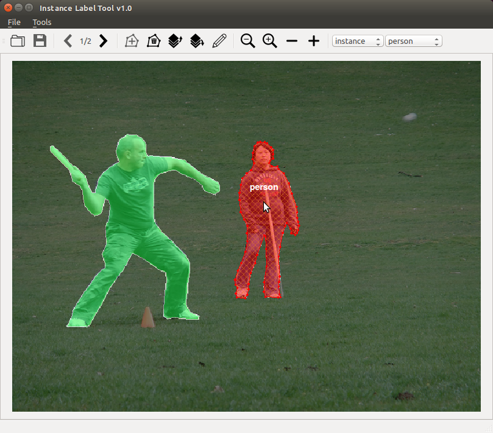
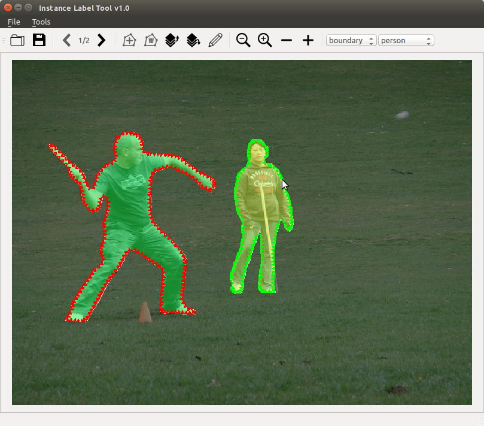

The motivation of developing this Instance Lable Tool comes from the demand to label the training data of paper [DOOBNet](https://github.com/GuoxiaWang/DOOBNet). This tool can also use for labeling instance segmentation. If you find Instance Label Tool useful for you, please consider **Star** or citing:
```
@article{wang2018doobnet,
  title={DOOBNet: Deep Object Occlusion Boundary Detection from an Image},
  author={Wang, Guoxia and Liang, Xiaohui and Li, Frederick WB},
  journal={arXiv preprint arXiv:1806.03772},
  year={2018}
}
```

## TODO
- [ ] Support converting to COCO json format
- [ ] Fix status bar's message display
- [ ] Support instnce label layer up/down
 
## Screenshot

### Instance type


### Boundary type


## Requirements
This tool tests sucessfully on Ubuntu 16.04.

1. pyqt4
2. cv2
3. json
4. scipy
5. numpy
6. getpass

## usage

### Steps
1. Run install instruction.
2. (Optional) Modify `config.json` to meet your demands, e.g. categories.
3. Write a `imagelist.json` file and save to the same folder with images.
4. Click 'Open' to load `imagelist.json`.
5. Click 'Left button' of mouse to draw a instance polygon and press 'Q' key to close the polygon (there are more than one polygon if the instance consist of multipart).
6. Press 'E' key to create a new instance label from the drawn polygons.
7. Continue to label all instances.
8. (Optional) Select 'boundary' type to automatically generate occlusion boundary.
9. Press 'Ctrl+S' to save the labels of current image or Press 'Right' key to label the next image.

### config.json

##### categories format

```
{
	"categories": [
		{
			"id" : int,
			"name" : str,
			"supercategory" : str
		}
	]
}
```

### Actions

|  Hotkey      | Action |
|:-------------:|------|
| - | Decrease instance labels transparency    |
| + | Increase instance transparency    |
| ← | Previous image |
| → | Next image   |
| o | Open the imagelist.json file|
| q | Close the drawing Polygon   |
| e | New Instance from the drawn closed polygons   |
| c | Delete select instance or drawing polygons |
| 0 | Temporarily not show instance labels   |
| w/s/a/d | Move up/down/left/right the canvas   |
| Ctrl + s | Save the modifies|
| Ctrl + Left Click | Select or deselect o instance   |
| Shift + Left Click | Delete a point of the closed polygon   |
| Left Click | Add a point to the drawing polygon, select a point and drag, or change occlusion boundary direction.   |
| Right Click | Delete the lastest point of the drawing polygon   |
| Mouse Wheel | Zoom in or zoom out    |
| Space + Mouse Drag | Move the canvas    |


## Data format

##### Annotation format
```
{
    "imgHeight": int, 
    "imgWidth": int, 
    "objects": list,
    "boundaries": dict (Optional)
}
```

##### objects format
```
{
    "date": str, 
    "deleted": bool, 
    "id": int, 
    "label": str, 
    "polygon": list,
    "user": str, 
    "verified": bool
}
```

##### boundaries format
```
{
    "date": str, 
    "deleted": bool, 
    "polygon": list,
    "user": str, 
    "verified": bool
}
```

## License
Instance Label Tool is released under the MIT License